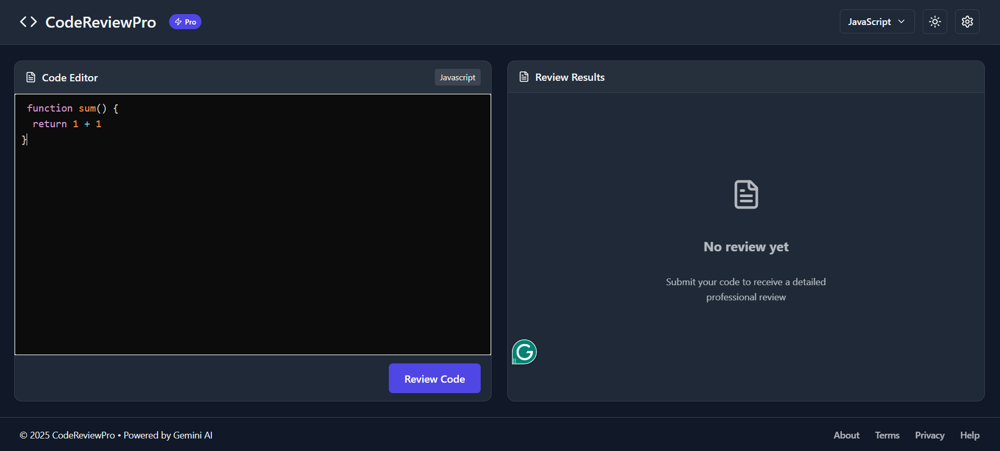
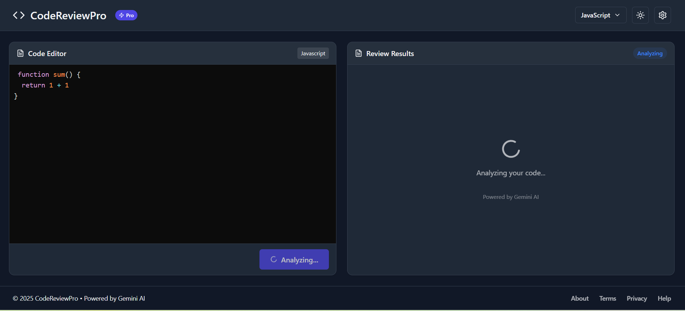
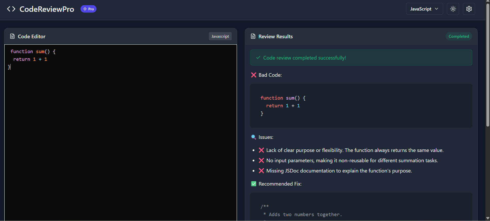

# CodeReview Pro 🚀

[](https://coderreviewpro.netlify.app/)

CodeReview Pro is a modern, AI-powered code review web application built with the MERN stack and integrated with **Google Gemini**. It allows developers to upload or paste code, select language preferences, switch between light/dark themes, and get intelligent, real-time code feedback — including reviews, suggestions, and enhancements.

---

## ✨ Features

- 🔍 **AI-Powered Code Review** (via Gemini API)
- 🌐 **Multi-language Code Support**
- 🎨 **Light/Dark Theme Toggle**
- ⚙️ **User Settings Panel**
- 📱 **Fully Responsive UI**
- 🔒 **Secure Backend with Express.js**
<!-- - ☁️ **MongoDB Atlas for Persistent Storage** -->

---

## 🛠️ Tech Stack

- **Frontend**: React, Tailwind CSS
- **Backend**: Node.js, Express
- **AI Integration**: Google Gemini API
- **Hosting**: Netlify (Frontend), Render (Backend)

---

## 📁 File Structure

```
frontend/
├── src/
│   ├── App.jsx              # Main application component
│   ├── App.css              # Enhanced styling
│   ├── LanguageSelector.jsx # New component for language selection
│   ├── index.css            # Base styling (unchanged)
│   └── main.jsx             # Entry point (updated)

backend/
├── controllers/
│   └── ai.controller.js     # Handles AI logic requests
├── routes/
│   └── ai.routes.js         # API route definitions
├── services/
│   └── ai.service.js        # Gemini API integration logic
├── app.js                   # Express app config
└── server.js                # Server entry point
```

---

## 🚀 Getting Started

### 1. Clone the repo

```bash
git clone https://github.com/rsakm/CodeReviewPro-An-Ai-powered-code-review-Application
cd codereview-pro
```

### 2. Install dependencies

```bash
# Root and client
npm install
cd frontend && npm install
```

### 3. Environment Variables

Create a `.env` file in the backend root and add:

```
GEMINI_API_KEY=your_gemini_api_key
PORT=4000

```

### 4. Run the application

```bash
# In root directory
npm run dev
```

---

## 📸 Screenshots

### Home Page


## Code analyzing interface


### Code Review Interface



---

## 📌 Future Improvements

- User authentication
- Save/load past reviews
- Shareable code review reports
- Enhanced language detection

---

## 🤝 Contributing

Contributions are welcome! Feel free to fork the repo and submit a PR.

---

## 📄 License

MIT License

---


## 🌐 Live Demo
Visit the live project here:
[](https://coderreviewpro.netlify.app/)

## 🧠 Credits

- [Google Gemini API](https://makersuite.google.com/)
- [React](https://reactjs.org/)
